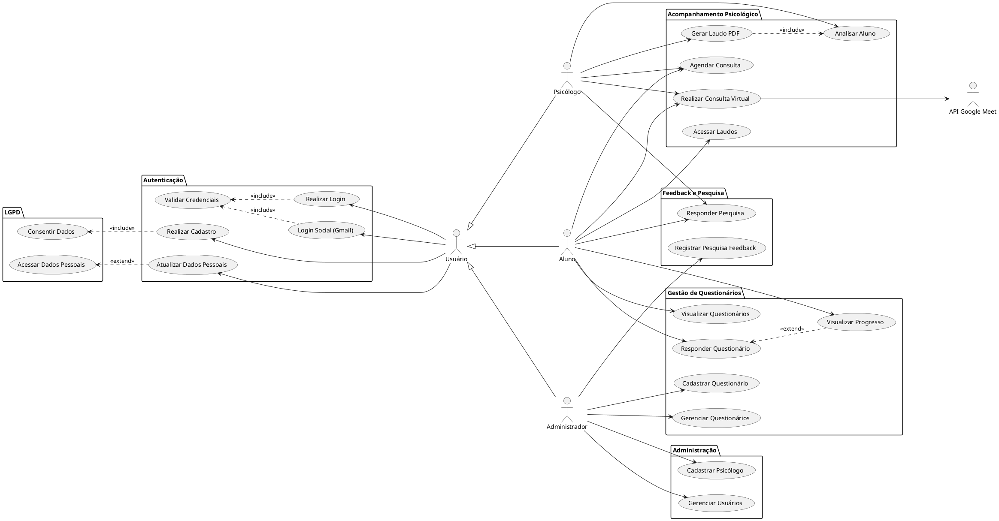

# Diagrama Global de Casos de Uso - Sistema de Teste Vocacional - Mind System

**Responsáveis**: Gustavo Rodrigues Ribeiro - GustavooRibas - Arquiteto de Software \
**Data**: 08/09/2025

## Equipe
| Aluno | GitHub |
|-------------|-------------|
|Gustavo Rodrigues Ribeiro | GustavooRibas
|Murillo Gordo de Andrade | murilloandrade
|Felipe Alves Leão de Araújo| FelipeAlvesLeao

## Introdução

Este documento apresenta o Diagrama Global de Casos de Uso para o Sistema de Teste Vocacional. O diagrama foi desenvolvido com base no escopo do projeto que visa auxiliar jovens estudantes do último ano do ensino médio na escolha de uma profissão, contribuindo para a redução dos índices de evasão escolar no ensino superior brasileiro.

O sistema oferece uma plataforma integrada de questionários vocacionais, acompanhamento psicológico e geração de laudos, utilizando tecnologia PWA para compatibilidade multiplataforma e conformidade com a LGPD.

## Atores

- **Usuário:** Ator base com funcionalidades de autenticação e gerenciamento de dados pessoais.
- **Aluno:** Estudante que utiliza o sistema para realizar testes vocacionais e receber orientação psicológica.
- **Psicólogo:** Profissional responsável pelo acompanhamento, análise e geração de laudos dos alunos.
- **Administrador:** Gestor do sistema com permissões para configurar questionários e gerenciar usuários.

## Casos de Uso (Visão Geral)

O sistema possui 19 casos de uso principais organizados em 6 pacotes funcionais:

- **Autenticação (5 casos de uso):** Cadastro, login tradicional e social, validação de credenciais e atualização de dados pessoais.
- **Gestão de Questionários (5 casos de uso):** Visualização, resposta e administração de questionários vocacionais, com acompanhamento de progresso.
- **Acompanhamento Psicológico (5 casos de uso):** Análise de alunos, geração de laudos, agendamento e realização de consultas virtuais.
- **Feedback e Pesquisa (2 casos de uso):** Sistema de coleta de feedback para melhoria contínua do sistema.
- **Administração (2 casos de uso):** Gestão de psicólogos e usuários do sistema.
- **LGPD (2 casos de uso):** Conformidade com a Lei Geral de Proteção de Dados.

## Diagrama de Casos de Uso (Imagem)

## Diagrama de Casos de Uso (Código PlantUML)

## Descrição do Diagrama

O diagrama apresenta uma visão global das funcionalidades do sistema, organizadas em pacotes lógicos para facilitar a compreensão:

### Organização dos Atores:
- **Hierarquia de Herança**: Aluno, Psicólogo e Administrador herdam as funcionalidades básicas do ator genérico "Usuário"
- **Especialização de Acesso**: Cada tipo de usuário possui permissões específicas alinhadas com seu papel no sistema

### Relacionamentos Principais:
- **`<<include>>`** (4 relacionamentos): Funcionalidades obrigatórias que sempre devem ser executadas
- **`<<extend>>`** (2 relacionamentos): Funcionalidades opcionais que podem ocorrer durante a execução de outros casos de uso
- **Integração Externa**: Conexão com a API do Google Meet para consultas virtuais

### Organização em Pacotes:
A estrutura em pacotes reflete os módulos funcionais do sistema, facilitando o desenvolvimento incremental e a manutenibilidade do código.

## Observações

- O diagrama foi elaborado seguindo a sintaxe **PlantUML** para facilitar manutenção e versionamento.
- A **organização em pacotes** agrupa casos de uso relacionados, melhorando a legibilidade e facilitando o entendimento da arquitetura do sistema.
- A **herança de atores** simplifica o modelo e representa corretamente a hierarquia de permissões no sistema.
- O diagrama foca na **visão global** das funcionalidades, sendo complementado por documentação detalhada de cada caso de uso em documento separado.
- A integração com **API externa** (Google Meet) demonstra capacidade de interoperabilidade do sistema.
