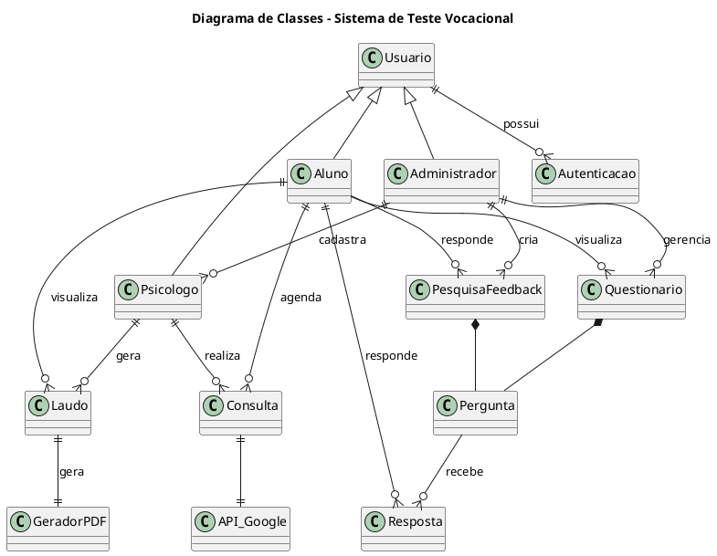
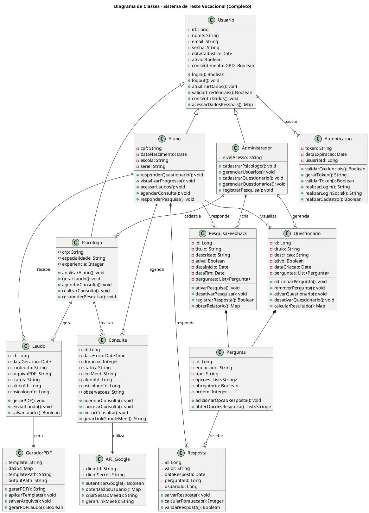

# Diagrama de Classes - Sistema de Teste Vocacional - Mind System

## Código PlantUML

## Diagrama de Classes mais detalhado com métodos e atributos

(Versão protótipo - Sujeita a mudanças)

## Código PlantUML

