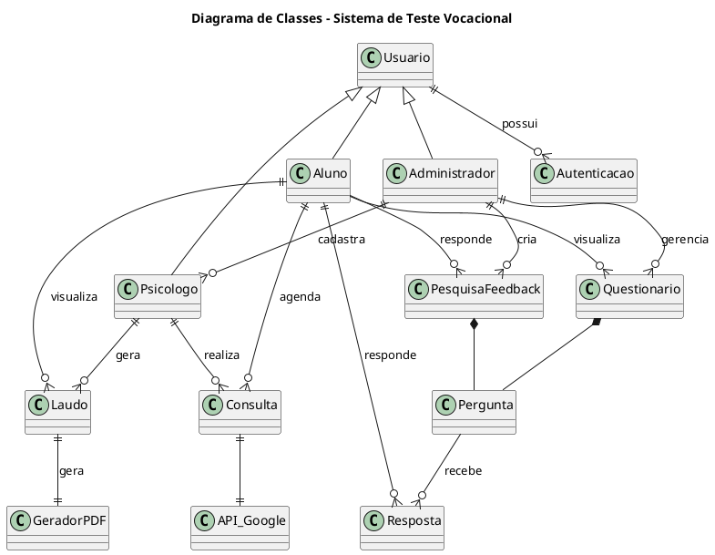

# Diagrama de Classes - Sistema de Teste Vocacional - Mind System

## Código PlantUML

```plantuml
@startuml
title Diagrama de Classes - Sistema de Teste Vocacional

class Usuario

class Aluno

class Psicologo

class Administrador

class Autenticacao

class API_Google

class Questionario

class Pergunta

class Resposta

class PesquisaFeedback

class Laudo

class Consulta

class GeradorPDF


Usuario <|-- Aluno
Usuario <|-- Psicologo
Usuario <|-- Administrador

Usuario ||--o{ Autenticacao : "possui"

Aluno ||--o{ Resposta : "responde"
Aluno ||--o{ Laudo : "visualiza"
Aluno ||--o{ Consulta : "agenda"
Aluno --o{ Questionario : "visualiza"
Aluno --o{ PesquisaFeedback : "responde"

Psicologo ||--o{ Laudo : "gera"
Psicologo ||--o{ Consulta : "realiza"

Administrador ||--o{ Questionario : "gerencia"
Administrador ||--o{ PesquisaFeedback : "cria"
Administrador ||--o{ Psicologo : "cadastra"

Pergunta --o{ Resposta : "recebe"

Consulta ||--|| API_Google
Laudo ||--|| GeradorPDF : "gera"

Questionario *-- Pergunta
PesquisaFeedback *-- Pergunta

@enduml
```
